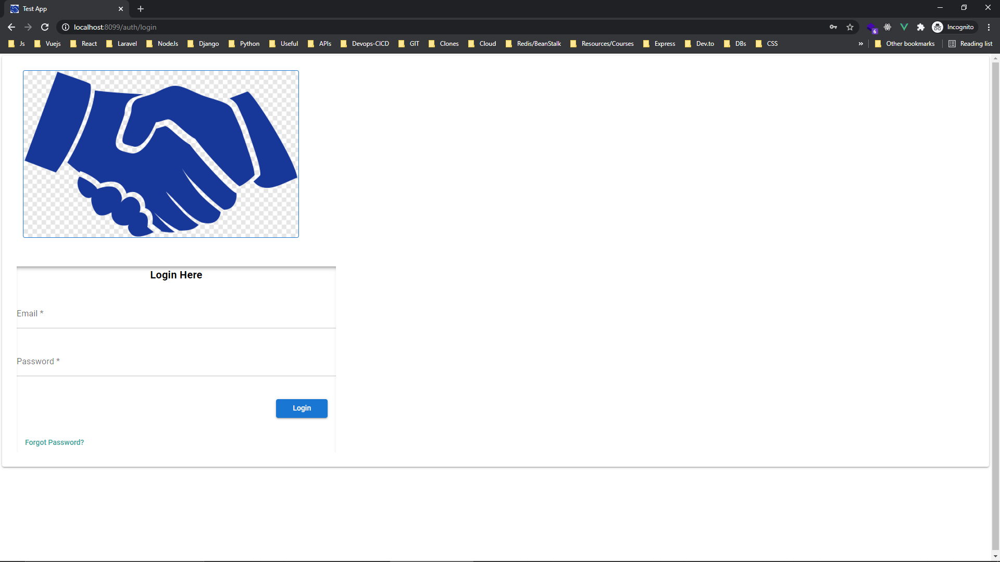
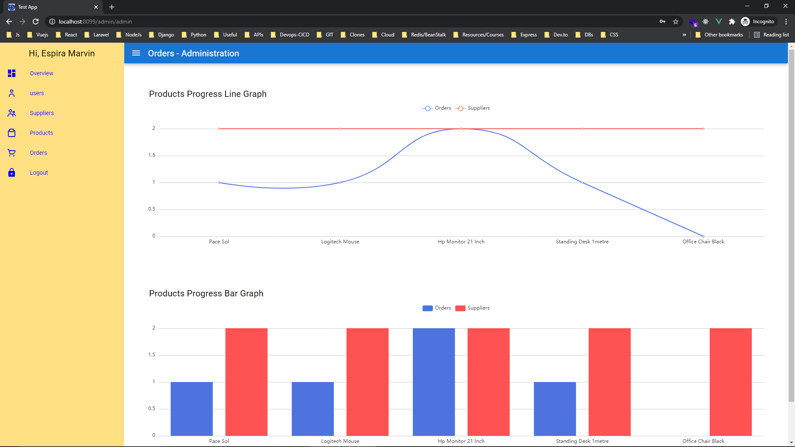
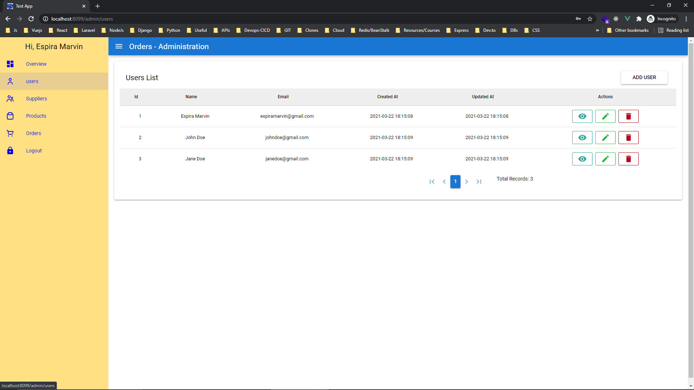
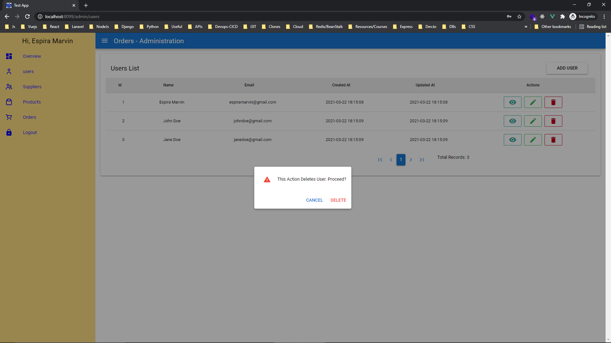
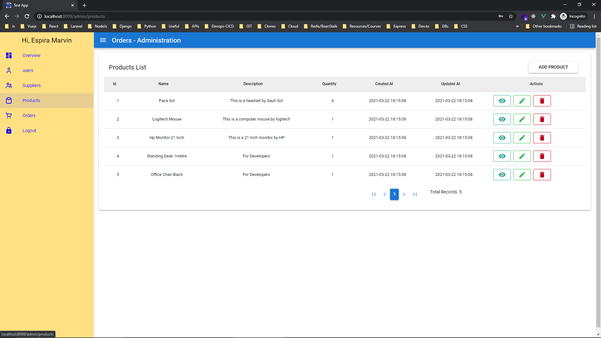
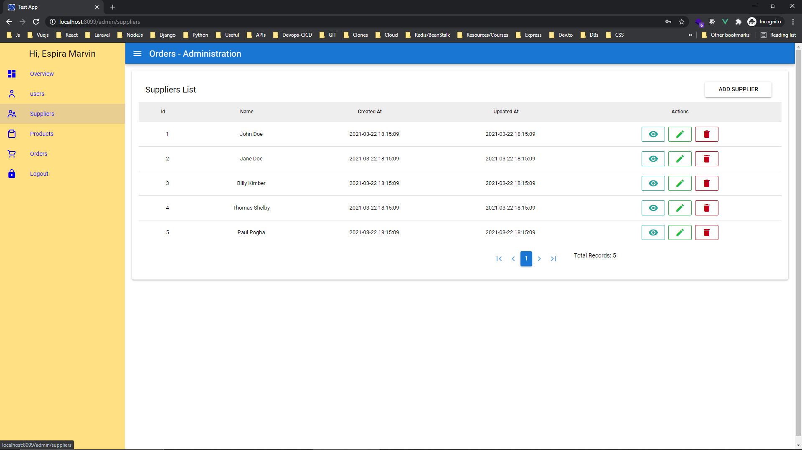
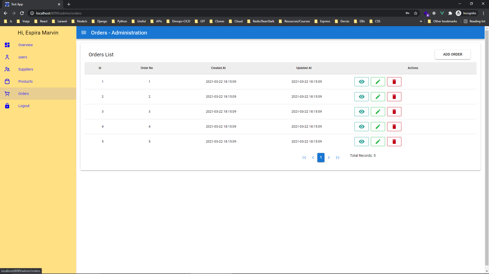

## About Orders

This is a laravel and Vue (with Quasar components) app to manage orders, suppliers and products


## API back end (laravel) Installation instructions
This repo only contains the back end of the app. 

There's a seperate repo with the front end that consumes this api

Open the terminal and navigate into the hosting directory and run the following commands:

#terminal
````
 git clone https://github.com/EspiraMarvin/order-app

 cd order-app

 composer install

```` 
 <p> Create a database (mysql/postgres) and give it a name, e.g orders. Copy .env.example to <b>.env</b> Then update the database name and password in this .env file</p>
 
 #terminal
 ``````
php artisan key:generate

 php artisan migrate:fresh --seed

 php artisan passport:install 

``````
<p>If everything went well up to this point, then the app is ready to server API end points. Start the serve using the command: </p>

#To serve the app
 ````
 php artisan serve

````
The app will be served through [localhost:80000](http://localhost:8000)

<p> The next step is to head to the front end Vue Repo and set it up. 

It will be calling this API from the url http://127.0.0.1:8000 that the previous command exposes. </p>

Open the terminal and navigate into the hosting directory and run the following commands:

 
 #terminal
 ````
 
  cd order-app

  cd appOrder  
 
 ```` 

# order App Front-end

setup .env file by copying .env.production to .env

## Install the dependencies
```bash
yarn
```

### Start the app in development mode (hot-code reloading, error reporting, etc.)
```bash
yarn dev
```

### Lint the files
```bash
yarn run lint
```

### Build the app for production
```bash
yarn build
```

It will be served via the link [localhost:8099](http://localhost:8099)


###credentials 
Email- espiramarvin@gmail.com
Password - 123secret


<div>
Login

Dashboard with graphs

Users Table

Delete User Prompt

Products

Suppliers

Orders


</div>
